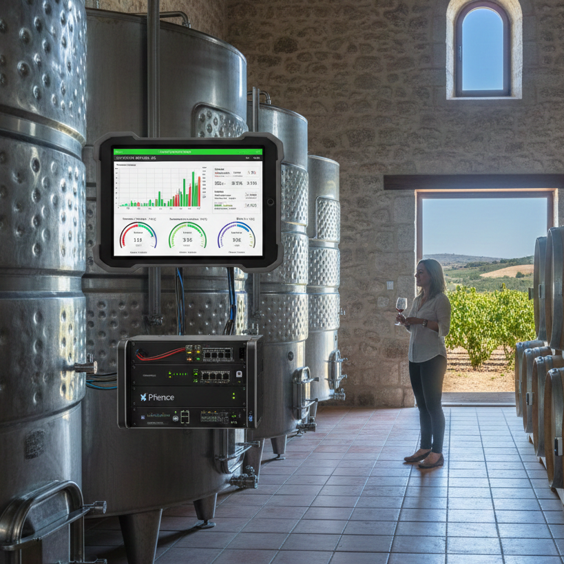
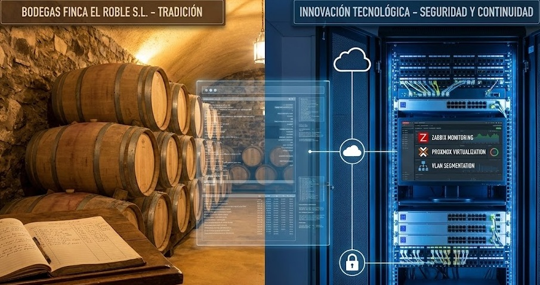

[Volver al índice general](../README.md)

# UD1 – Análisis del entorno y detección de necesidades tecnológicas

## Índice de apartados

# 1. 🍇 Análisis del Sector Tecnológico: Vitivinicultura en Andalucía

El sector tecnológico es el principal motor de crecimiento en la región de Andalucía, esta centrado en el Parque Científico y Tecnológico Cartuja. Segun el inform de actividad de 2023/2024 este ecosistema contiene 567 empresas y cuenta con una facturacion de casi 5 millones de euros, además, está dando empleo a casi 30 mil personas. Es un volumen de negocio que garantiza una demanda sostenida de adimisntradores de sistemas para gestionar centros de datos y redes coporativas que requieren una alta dispoinibilidad.

Por otro lado Sevilla es la líder en tecnología con el cluster Andalucía Aerospace y la Agencia Espacial Española. De hecho, el inform del Sector Aeroespacial en Andalucía en 2023 registró 2700 millones de euros en facturación, demandando perfiles especializados en cuberseguridad y redes. Por otro lado tenemos inciativas como el proyecto Sevilla NODE que impulsan la necesidad de integrar IoT (Internet de las cosas) apoyandose en servidores seguros y validando la pertinencia técnica.

###### *Imagen generada con Gemini Nano Banana

# 2. 🍇 Selección de la empresa o contexto de trabajo

Este proyecto se basa en Bodegas Finca El Roble S.L., una empresa familiar ficticia pero realista ubicada en la zona de Cazalla de la Sierra (sierra norte de Sevilla). Esta empresa simula las empresas reales de andalucía que se dedican a la producción de vinos tinto bajo la normativa IGP Sierra Norte. En este caso la empresa esta en una fase de expansión internacional por lo que han visto necesario cumplir con los estándares de calidad europeos. Su estructura organizativa tiene una base tradicional, con departamentos de produccion y administración pero carece de un deparetamento dedicado a la informática interna.

La situacion tecnologica actual de la empresa resulta en un riesgo critico ya que la bodega opera con una red plana sin segmentación, por lo que mezclan trafico de red de maquinarias, invitados y trabajadores internos. Por esto vemos que sus datos más críticos están alojados en PCs individuales sin ningún tipo de copias de seguridad. Por otro lado el control de temperatura de las naves donde se cria el vino se hace individualmente, algo demasiado tosco y desactualizado para el nivel de expandión que está alcanzando la empresa.

###### *Imagen generada con Gemini Nano Banana

# 3. 🍇  Identificación de necesidades tecnológicas

El análisis de la infraestructura, que se ha contrastado con las recomendaciones del INCIBE y el Observatorio de Digitalizacion del MAPA revela tres principales necesidades muy urgentes: seguridad en las redes, disponibilidad de servicios y automatizacion de datos. La red que tienen actualmente es vulnerable a todo tipo de ataquesm desde ramsonware hasta ataques DDOS ya que como comentamos anteriormente carece de segmentacion y además como también comentamos antes el software que tiene es muy limitado y en parte se debe a que el hardware que utilizan está toalmente obsoleto y desactualizado, de hecho, los PCs de la empresa tienen todos el sistema operativo Windows 8. También hay que destacar que los errores humanos con el sistema actual son muy fáciles de materializar.

Lo que propone este proyecto para cubrir las necesidades de esta familiar empresa es implementar el sistema SMEGI, cuyas siglas significan: sistema de monitorizacion y gestion energetica inteligente. La solución en este caso incluye el despliegue de una arquitectura virtualizada con Proxmox para garantizar una alta disponibilidad, la segmentacion de red mediante VLANs y Firewalls para aislar el trafico industrial del administrativo. También se propone monitorización centralidad para digitalizar el control ambiental.

###### *Imagen generada con Gemini Nano Banana

# 4. 🍇  Oportunidades y viabilidad del proyecto

El sistema SMEGI ofrecen muchas oportunidades estrategicas claras: ahorro de costes operativos y mejora de calidad del producto. Al monitorizar en todo momento las naves de crianza conseguimos optimizar el uso de la climatizacion reduciendo asi un ahorro energetico y garantizando ademas la estabilidad termica necesaria para poder certificar el vino de la finca como Premium. Por otro lado adoprtar una intraestructura vritualizada favorece a la escalalbilidad ayq eu permite agregar servicios en un futuro como una tienda on-line.

Desde una perspectiva tecnica y economica la viabilidad del proyecto esta garantizada ya que tecnicamente se utlizan estandares de mercado robustos y ampliamente documentados como son Linux, TCP/IP, etc. Por otro aldo en el plano económico (como veremos en el punto 6) es altamente rentable para una Pyme ya que estamos maximizando el uso del software libre centrando la inversion en hardware actualizado y esencial para este tipo de infraestructuras.

###### *Imagen generada con Gemini Nano Banana

# 5. ⚖️ Obligaciones legales y normativas

Este despliegue implica el cumplimiento del reglamento general de protección de datos y la LOPDGDD (Ley Orgánica de Protección de Datos Personales y garantía de los derechos digitales) ya que se van a gestionar credenciales de acceso y regsitros de actividad de los empleaod. Para ello se van a implementar medidas de seguridad por diseño como el control de acceso nominal para evitar usuarios genéricos y el cifrado de comunicaciones con VPN y HTTPS.

En el ámbito industrial y de propiedad intelectual el proyecto va a respetar las licencias de uso de software para Linux y Proxmox. Además la instalación física del servidor y el equipam,iento en red en el rack va a cunmplir con el reglamento electrotecnico para baja tension y la normativa de prevencion de riesgos laborales con lo que se asegura también una correcta ventilzación.

###### *Imagen generada con Gemini Nano Banana
# 6. 📝 Guion inicial del proyecto (Roadmap)

El proyecto se va a estructurar en 5 fases secuenciales que garantizan el exito tecnico: fase 1: diseño de la topología y direccionamiento IP, fase 2: la infraestructura hardware para el hypervisor Proxmox, fase 3: centrada en la segmentacion con vlanes y firewall, la fase 4: para el despliegue de zabbix y grafana y la fase 5 para la politica de backups y documentación. 

Por otro lado ahora si vamos a cubir la parte de viabilidad economica del presupuesto ya que el coste estimado del hardware de servidor, switches y sensores se situaría entre los 2500 y 3000 euros, que es una cifra muy asumible para una pyme del sector vitivinícola. Es importante tener en cuenta que el software que utilizaremos es 100% opensource por lo que el coste de implementarlos es 0, asi que el coste operativo se reduce en gran manera. Esto confirma definitivamente que el proyecto es financieramente sostenible.

###### *Imagen generada con Gemini Nano Banana

## Enlaces a recursos de la unidad

- [Documentos de la unidad](./documentos/)
- [Imágenes](./img/)

###### *Imagen generada con Gemini Nano Banana
